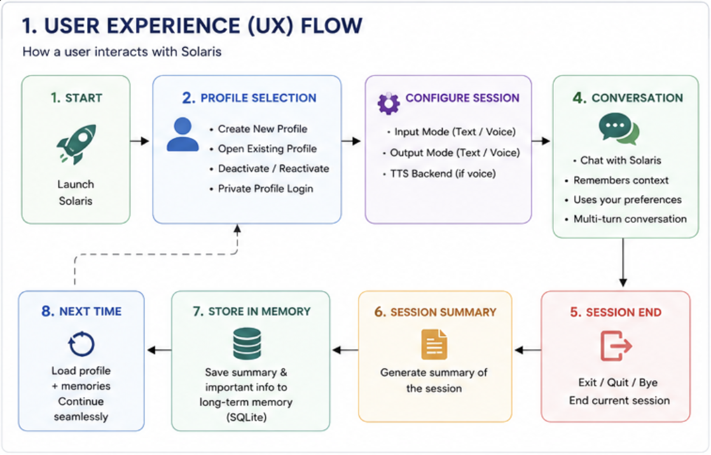
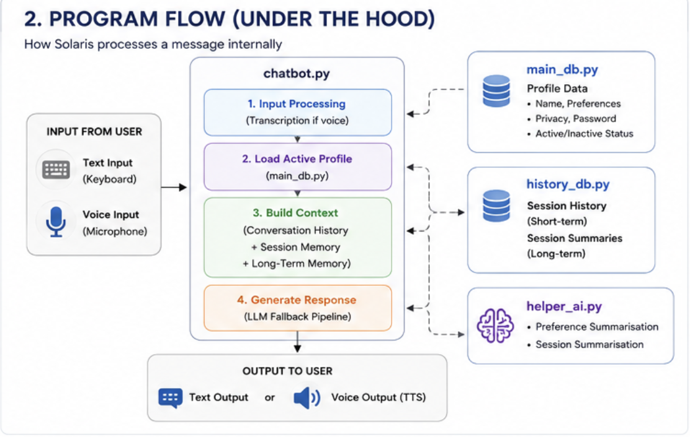
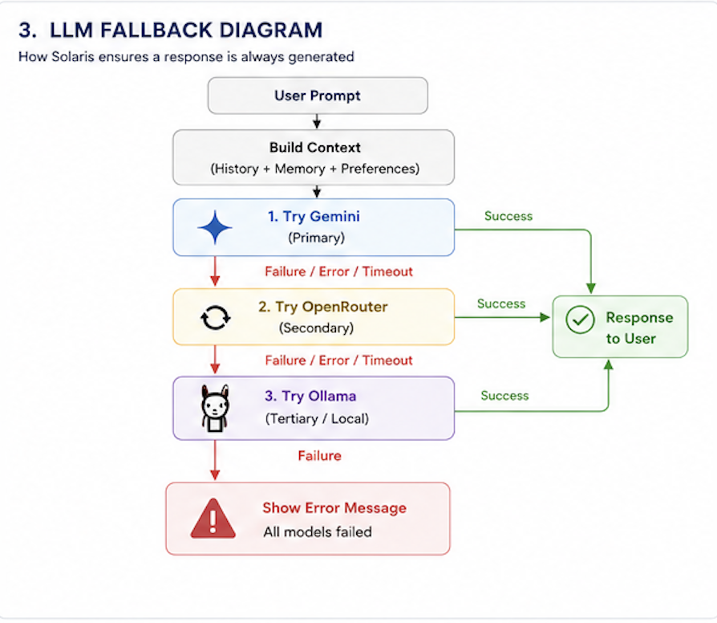
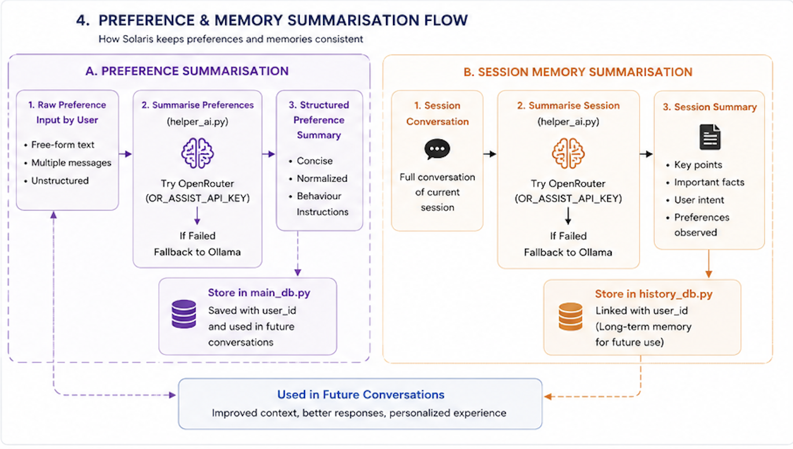

# <u>Solaris – Personal AI Chatbot</u>


A local, profile-aware AI chatbot with persistent memory, multiple LLM fallbacks, voice support, file attachments, web search, study tools, and SQLite-backed long-term context.

Solaris is designed to maintain personalized conversations across sessions by combining conversation history, summarized memories, and user preferences. It supports multiple user profiles, private accounts, and graceful fallback between different AI providers.

---

## <u> Features ✨ </u>

* 💬 Text and voice input
* 🔊 Text and voice output
* 👤 Multiple user profiles
* 🔒 Password-protected private profiles
* 🧠 Long-term memory using SQLite
* 📝 Automatic session summarization
* ⚙️ User preference learning
* 🔄 Multi-provider AI fallback
* 📎 File attachments (md, pdf, jpg, png) as session context
* 👁️ `.VISION` image analysis with vision-capable models
* 🔎 `.WEB` real-time web search with multiple depths
* 📚 Study commands (detail, simple, quiz, timeline, compare, steps)
* 🎯 `.BETTER` specialist answers (Writer, Programmer, Strategist)
* 💾 Local-first architecture

---

## <u> Project Structure 🧱 </u>

The Important files of this project and their use cases are as follows:

|File	|Purpose|
|---|---|
|chatbot.py	|Main assistant with chat, profiles, memory, voice, commands and dispatch
|helper_ai.py	|Preference extraction and session summarization
|specialist_ai.py	|Specialist flows for `.BETTER` (Writer, Programmer, Strategist)
|study_ai.py	|Study command prompt builders for `.DETAIL`, `.QUIZ`, `.TIMELINE`, etc.
|web_search.py	|Web search providers for the `.WEB` command (Tavily, Firecrawl)
|vision_ai.py	|Image analysis for the `.VISION` command (NVIDIA NIM models)
|attachment.py	|File attachment system — ingestion, temporary context, vision helpers
|config.py	|Provider API client initializers (Gemini, OpenRouter, NVIDIA, Groq, Ollama Cloud)
|model_control.py	|Model selection and fallback control
|index.py	|Entry-point helpers and startup orchestration
|main_db.py	|Profile management and user database
|history_db.py	|Long-term conversation history storage
|tui_utils.py	|Terminal UI helpers (markdown rendering, tables, prompts)
|spinner.py	|Loading spinners and recording timer
|requirements.txt	|Project dependencies

---
## <u> Architecture </u>








---


## <u> How Solaris Works </u>

The assistant maintains three layers of context:

1. Current Conversation – Active chat history.
2. Session Memory – Important facts summarized during the current session.
3. Long-Term Memory – Persistent summaries stored in SQLite and retrieved in future conversations.

User preferences are automatically summarized into concise behavioral instructions, allowing Solaris to remain consistent across multiple sessions.

On top of this sits **temporary file context** — files you attach with `.ATTACH` are held in memory for the session only. They inform specialist, vision, and chat responses but are **never** written to permanent memory.

---

### <u> Profiles 👤 </u>

At startup, Solaris allows you to:

* Create new profiles
* Open existing profiles
* Update profile preferences
* Activate or deactivate profiles
* Secure private profiles with a numeric password

---

### <u> Chat Modes 🎙️ </u>

Choose your preferred interaction style:

**Input**

* Text
* Voice

**Output**

* Text
* Speech

You can also switch between supported text-to-speech backends during runtime with `.VOICE`.

---

### <u>Model Fallback Pipeline 🔁</u>

Solaris automatically switches providers if one becomes unavailable.

Primary Chat Pipeline

1. Gemini
2. OpenRouter
3. Ollama

Memory & Preference Summarization

1. OpenRouter
2. Ollama

This ensures the assistant continues functioning even if cloud providers fail.

---

## <u> Built-In Commands ⌨️ </u>

### General Commands

| Command | Description|
| --- | --- |
|`.HELP`	| Display available commands
|`.CHANGE`	|Switch to another public profile
|`.VOICE`	|Change the speech backend
|`.ABOUT` |Displays Information about Solaris, and Profile Details
|`.UPDATE_PRIVACY` | To Update Privacy Settings
|`.CLEAR` | Clears the terminal window. Conversation, memory, and context remain unchanged.
|`.ATTACH` | Attach a file (md, pdf, jpg, png) as temporary session context
|`.DETACH` | Remove a file attachment from session context
|`.VISION[:question]` | Analyze attached images with a vision-capable model
|`.WEB[:quick\|:standard\|:deep] <question>` | Search the web for real-time information (primary: Tavily, fallback: Firecrawl)
|exit, quit, bye, goodbye, close	|Save the session summary and exit

### Study Commands

| Command | Description|
| --- | --- |
|`.DETAIL <topic>` | Explain a concept in depth, like a teacher
|`.SIMPLE <topic>` | Explain a concept in simple language
|`.QUIZ <topic>` | Generate a 10-question quiz with answers
|`.TIMELINE <topic>` | Show events in chronological order
|`.COMPARE <topic>` | Compare subjects side by side
|`.STEPS <topic>` | Break down a process into steps with explanations

---

### <u> File Attachments 📎 </u>

Attach files so Solaris can work with their actual content:

```
.ATTACH /path/to/notes.md
.ATTACH /path/to/report.pdf
.ATTACH /path/to/screenshot.png
```

| Type | Behaviour |
|---|---|
| `.md` | Full text read as context |
| `.pdf` | Text extracted page by page (no OCR for scanned pages) |
| `.jpg` `.jpeg` `.png` | Validated as an image, ready for `.VISION` |

* Attachments are **temporary** — held only for the session and cleared on exit.
* They are **never** written to the database or long-term memory.
* `.DETACH` shows a numbered list and removes your choice.

After attaching, Solaris gives a subtle suggestion for the best next step:
* Markdown → use `.BETTER` for context-aware specialist answers
* Image → use `.VISION <question>` to analyze it

---

### <u> `.BETTER` — Specialist Answers 🎯 </u>

Get a higher-quality answer by routing your request through a dedicated specialist:

1. **Writer** — polished, convincing prose
2. **Programmer** — code-first technical solutions
3. **Strategist** — a step-by-step reasoning flow that interviews you with targeted questions before drafting a full strategy

`.BETTER` is now **context-aware**:

* When files are attached, Solaris shows a numbered picker and asks which files the specialist should take into account.
* Selected files shape the Strategist's questions to suit your expertise and material, rather than generic questions.
* With one file attached it is used automatically; with none, everything works exactly as before.

---

### <u> `.VISION` — Image Analysis 👁️ </u>

Analyze attached images with a vision-capable model:

```
.ATTACH /path/to/screenshot.png
.VISION what is wrong with this error message?
```

* Uses a dedicated vision model (NVIDIA NIM): **Kimi-K3** primary, **Llama-3.2-90B-Vision** fallback
* Single image → analyzed directly; multiple images → pick which to use
* Falls back gracefully if the primary model fails
* Models are configurable in `config.json` under `vision_model`

---

### <u> `.WEB` — Web Search 🔎 </u>

Search the web for real-time information when chat memory is not enough:

| Syntax | Depth | Behaviour |
| --- | --- | --- |
| `.WEB:quick <question>` | 3 results | Fast, surface-level search |
| `.WEB <question>` | 5 results | Default (standard) depth |
| `.WEB:deep <question>` | 8 results | Thorough, source-heavy search |

* Primary provider is **Tavily**, fallback is **Firecrawl**.
* Results are synthesized into a single answer with source links.
* Each search is logged to the `web_log` table (query, provider, depth, sources) — raw page content is not persisted.

---

## <u>Requirements 📌</u>

* Python 3.11+
* SQLite
* Microphone (for voice input)
* Audio output device (for speech)
* Ollama (optional, for offline fallback)
* Gemini API Key (optional)
* OpenRouter API Key (optional)
* NVIDIA NIM / Groq API access (optional, for vision and chat providers)
* Tavily + Firecrawl API keys (optional, for `.WEB`)

---

## <u>Installation 🛠️</u>

Install the required dependencies:

```bash
pip install -r requirements.txt
```
---

Environment Variables

Create a .env file in the project root.

```bash
GEMINI_API_KEY="your_gemini_api_key"
OR_API_KEY="your_openrouter_api_key"
OR_ASSIST_API_KEY="your_openrouter_helper_api_key"
TAVILY_API_KEY="your_tavily_api_key"
FIRECRAWL_API_KEY="your_firecrawl_api_key"
```

<u>API Usage 🔐</u>

|Variable |	Purpose |
|---|---|
|GEMINI_API_KEY	|Primary Gemini chat requests
|OR_API_KEY	| OpenRouter fallback chat
|OR_ASSIST_API_KEY	| Preference and memory summarization
|TAVILY_API_KEY	| Primary web search provider for the `.WEB` command
|FIRECRAWL_API_KEY	| Fallback web search provider for the `.WEB` command

---

## <u>Running the Assistant ▶️</u>

Start the standard assistant:
```bash
python chatbot.py
```

The assistant will:

1. Initialize the database
2. Select input mode
3. Select output mode
4. Open or create a user profile
5. Begin the conversation

---

## <u>Runtime Files 💾</u>

The following files are generated while Solaris is running:

| File	| Purpose |
|---| --- |
|database.db	|SQLite database
|System_Logs.txt	|Application logs
|input.wav |	Recorded voice input
|output.wav	| Generated speech output

---

## <u>Database Design 🗂️</u>

The assistant separates user information from conversational memory.

### <u>user_data</u>

**Managed by main_db.py**

Stores:

* User profiles
* Passwords
* Privacy settings
* Activation state

### <u>history</u>

**Managed by history_db.py**

Stores:

* Session summaries
* Long-term memory
* Associated user_id

Separating these tables keeps profile management independent from conversational memory while maintaining their relationship through the user ID.

### <u>web_log</u>

**Managed by history_db.py**

Stores:

* Web search metadata for the `.WEB` command
* Query, provider used (tavily / firecrawl), depth, and source URLs
* Associated user_id and timestamp

Raw retrieved web content is intentionally <b>not</b> persisted to keep the database small.

---

## <u>Notes 📝</u>

* Voice input records a short audio sample before transcription.
* Private profiles are protected using a numeric password.
* Deactivated profiles require an activation code before reuse.
* If cloud providers become unavailable, Solaris automatically falls back to Ollama (when configured).
* Attachments never persist beyond the session — use `.BETTER`, `.VISION`, or normal chat to work with them while they last.

---

## <u>Future Improvements 🚀</u>

* Additional local model support
* Richer long-term memory retrieval
* Smarter preference learning
* Plugin and tool integration
* Expanded desktop automation capabilities


## <u> P.S. </u>

Solaris serves as the core AI engine behind another project called Stellar.

Stellar currently integrates Solaris v1.0.0 as its conversational backend. From Solaris v1.0.1 onward, both projects are developed and maintained independently. Future updates to Solaris may not be reflected in Stellar unless they are explicitly integrated.

---

© 2026 Shivansh Singh
Solaris is licensed under the MIT License.
See the LICENSE file for details.